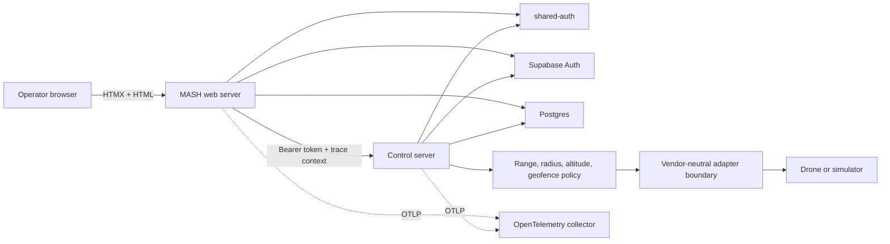

# Architecture

## Runtime responsibilities

The web server owns browser interaction, encrypted database-backed sessions, and the MASH operator experience. It accepts either a shared-auth login or a Supabase login. Supabase identities are exchanged into shared-auth so the browser session carries both token families without exposing either token to HTMX or browser storage.

The control server is the authorization and domain boundary. It verifies shared-auth or Supabase bearer tokens, resolves tenant-scoped roles, persists the fleet model in Postgres, evaluates flight policies, and dispatches accepted commands through a drone adapter.

Drone adapters isolate make- and model-specific transport. The domain uses capability declarations and normalized commands, so MAVLink, vendor HTTP APIs, SDK bridges, and a simulator can coexist without leaking vendor concepts into jobs or safety policy.

## Safety and tenancy

Commands and jobs are tenant-scoped. Roles are reduced to explicit permissions before handlers execute. A command must pass capability checks and flight-policy checks—including home radius, route distance, altitude, and polygon geofences—before an adapter receives it. The current adapter contract queues protocol-specific delivery; production adapters should add acknowledgment, idempotency, and emergency-stop semantics appropriate to each aircraft.

## Deployment ownership

Each Rust repository builds its own OCI image and owns its Kubernetes manifests. The infrastructure repository owns the Argo CD project/applications and public Cloudflare edge. The monorepo is a reproducible inventory and cluster-side clone; it is not the source path consumed by Argo CD.
