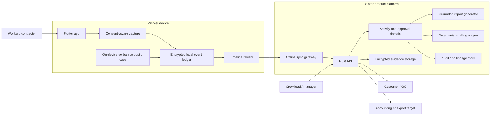
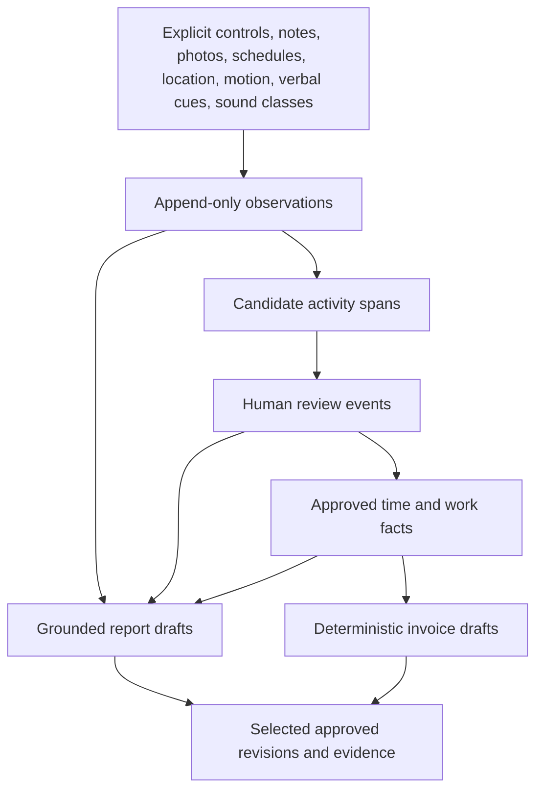

# Architecture

## Architectural status

This is the accepted incubation architecture for the contractor work-intelligence
sister app. The final product slug and repository organization remain unresolved,
so current code and contracts live behind removable incubation boundaries in the
Sonus Auris organization. No document in this directory authorizes sharing a
production database, credentials, signing identity, cloud project, or deployment
role between Sonus Auris and the future sister product.

## System context

The device remains useful offline. The cloud platform provides multi-device and
multi-user coordination, policy, reports, billing drafts, selective evidence,
exports, and durable organization-level history.

## Core data flow

No edge may skip directly from an observation or candidate span to an accounting
or external-consequence record.

## Logical components

### Mobile and desktop application

Responsibilities:

- authenticate and enroll the device;
- show recording, microphone, location, motion, and sync state clearly;
- create/select jobs and job sessions;
- capture explicit controls and local observations;
- execute low-power on-device cue recognition where supported;
- encrypt and persist events before acknowledging capture;
- allow offline review and correction;
- synchronize append-only events and projections;
- render approved reports and invoice drafts;
- support export, redaction, deletion requests, and selective evidence sharing.

The app must not contain hidden manager-only recording controls or silent worker
scoring.

### Capture and cue runtime

Responsibilities:

- segmented, consent-aware audio capture;
- low-power voice activity and configured keyword detection;
- optional non-speech acoustic classification;
- timestamp and monotonic-clock capture;
- rolling buffers and explicit clip selection;
- local retention deadlines and deletion;
- pause behavior for calls, exclusion zones, and user controls;
- emission of content-minimized observations.

The runtime should be extracted from Sonus capabilities through versioned APIs.
Contractor jobs, invoices, crews, and customer concepts must not leak into the
generic capture package.

### Local event ledger

The device stores append-only records before sync:

- job/session lifecycle events;
- sensor and cue observations;
- evidence metadata;
- candidate spans;
- review decisions and corrections;
- local projections;
- sync envelopes and acknowledgements;
- retention, redaction, and deletion events.

SQLite is the likely mobile/desktop store. Records need stable IDs,
idempotency keys, tenant/job/session scope, source device, producer/version,
created/occurred timestamps, and a monotonic offset when available.

### Synchronization layer

The synchronization layer should use opto-sync-compatible principles:

- append-only event exchange;
- stable client-generated IDs;
- idempotent writes;
- per-device cursors;
- explicit tombstones or availability transitions rather than silent deletion;
- deterministic projection rebuilds;
- conflict surfacing when two humans revise the same logical interval;
- no last-write-wins replacement of audit history;
- bounded retries and dead-letter visibility;
- encrypted payload handling and strict tenant scoping.

Capture must continue during a network or server outage. Sync delay should affect
collaboration and cloud exports, not the existence of the worker's local record.

### Rust API and domain services

Responsibilities:

- organization, role, customer, site, job, assignment, and policy management;
- authenticated append and query APIs;
- event validation and tenant/job/session authorization;
- candidate activity inference orchestration;
- review and projection state machines;
- rate cards and deterministic calculation policies;
- report and invoice draft creation;
- audit and lineage queries;
- exports and customer-sharing revisions;
- retention, legal-hold, redaction, and deletion workflows;
- observability without raw audio in ordinary logs.

SeaORM/Postgres is the preferred server persistence stack. Domain services should
consume versioned interfaces and keep calculations in pure, testable Rust modules.

### Inference workers

Responsibilities:

- transform observations into candidate spans;
- attach confidence, alternatives, model/rule identity, configuration hash, and
  source observation IDs;
- avoid external claims or billing side effects;
- publish evaluation telemetry that is content-minimized;
- support replay against versioned golden fixtures;
- retain enough provenance to explain and invalidate a model version.

Rules and interpretable temporal models should precede broad neural automation.
A hidden semi-Markov model or similarly duration-aware estimator is a reasonable
first state model; the product contract does not depend on a specific algorithm.

### Report generator

The report generator may use deterministic templates and an LLM-assisted drafting
layer. It must:

- accept only permitted source record classes;
- preserve source references per statement;
- refuse unsupported external claims;
- distinguish draft from approved/frozen revisions;
- avoid including raw transcript or private conversation by default;
- allow user edits without losing source lineage;
- pin template and generator versions.

### Billing engine

The billing engine is ordinary deterministic code. It owns:

- rate-card versions;
- hourly, fixed-price, travel, equipment, materials, minimum-charge, overtime,
  discount, tax, deposit, retainage, and rounding policies as they are introduced;
- integer minor-unit arithmetic;
- line-item source references;
- draft revision history;
- idempotent generation;
- calculation explanations and golden vectors.

An LLM may propose a human-readable line description. It never decides quantities,
rates, taxes, or totals.

### Evidence service

Raw evidence is optional and separately governed. The service stores encrypted,
opaque objects and metadata such as:

- owner and tenant;
- job/session scope;
- evidence type;
- availability state;
- encryption/key version;
- retention deadline;
- selected sharing grants;
- redaction or deletion history;
- content hash where policy permits.

Database rows and logs must never embed storage credentials or signed URLs.

## Current incubation repositories

| Concern | Current location | Boundary |
| --- | --- | --- |
| Product-wide architecture and handbook | `sonus-auris-monorepo/docs/contractor-work-intelligence/` | Documentation only |
| v1 portable ledger contract | `sonus-auris-interfaces/incubation/contractor-work-intelligence/v1/` | No production tables |
| Future temporary domain adapter | `sonus-auris-api-server.rs` | Feature-flagged and contract-driven |
| Future prototype review UI | `sonus-auris-ui.dart` | Feature-flagged; no hidden monitoring |
| Shared capture primitives | Existing Sonus repos until extraction | Must remain domain-neutral |

## Minimum final repository topology

After naming and organization discovery, create only repositories with a real
release, scaling, ownership, or access-control boundary:

| Repository | Responsibility |
| --- | --- |
| `<slug>-app` | Flutter mobile/desktop clients and native background adapters |
| `<slug>-api.rs` | Rust API, domain state machines, reporting, billing, authorization |
| `<slug>-interfaces` | JSON Schema/OpenAPI/events, generated validators/clients, fixtures |
| `<slug>-infra` | GitOps, environments, secrets contracts, backups, observability |
| `<slug>-site.web` | Marketing and customer portal only if its release boundary differs |

Additional worker, CLI, model, or admin repositories require a documented reason.
Do not create a repository fleet merely to display progress.

## Deployment isolation

The sister product must have separate:

- cloud accounts/projects or clearly isolated accounts with dedicated roles;
- databases and migration histories;
- object-storage buckets and encryption keys;
- service identities and secrets;
- OAuth applications and redirect URIs;
- mobile bundle IDs, signing certificates, and store listings;
- observability projects and access policies;
- backup and restore procedures;
- incident ownership and on-call paths.

Versioned shared libraries are acceptable. Shared production credentials and a
shared application database are not.

## Multi-tenancy and authorization

Every durable domain record must carry or derive an immutable tenant boundary.
Sensitive operations also require job/session and actor authorization.

Minimum role concepts:

- organization owner/admin;
- worker/contractor;
- crew lead/reviewer;
- billing administrator;
- customer/guest recipient;
- support role with break-glass, audited, content-minimized access.

Authorization rules must distinguish:

- seeing derived event metadata;
- hearing or downloading raw audio;
- reviewing another worker's candidate timeline;
- approving time;
- generating versus issuing an invoice;
- selecting evidence for customer sharing;
- changing retention or capture policy;
- exporting organization data.

## Data classification

| Class | Examples | Default handling |
| --- | --- | --- |
| Restricted raw evidence | audio clips, photos, receipts with personal data | local-first, encrypted, short retention, selective access |
| Sensitive derived content | transcript snippets, customer decisions, location, incident notes | encrypted, job-scoped, purpose-limited |
| Business records | approved time, reports, invoice drafts, change orders | durable, versioned, audited |
| Operational metadata | model version, confidence, sync status, device health | content-minimized, no raw payloads |
| Public/exported content | customer-approved report/invoice revision | immutable revision and explicit grant |

## API style

- OpenAPI 3.1 for synchronous HTTP APIs.
- Versioned event envelopes for append/sync and asynchronous jobs.
- Stable idempotency keys for writes and projections.
- Explicit revision and previous-revision IDs for reports/invoices.
- Problem-details-compatible error bodies with safe diagnostic codes.
- Cursor pagination for timelines and audit history.
- ETags or revision tokens for editable projections, without replacing append-only
  source events.
- Generated Rust, Dart, and TypeScript validators from canonical contracts.

## Failure behavior

### Device offline

Capture and review continue locally. Sync state is visible. The app must not imply
that cloud sharing or multi-device approvals are current.

### Microphone unavailable

The session remains active only if policy permits a non-audio mode. The UI shows
that audio capture is unavailable. No synthetic observation may claim sound was
captured.

### Inference unavailable

Observations remain durable. Manual review and entry continue. Candidate spans can
be generated later with a pinned model version.

### Report model unavailable

Provide deterministic templates or postpone narrative drafting. Never generate
unsupported text from memory or stale unrelated data.

### Billing policy missing

Block the affected line and request a rate/policy decision. Do not silently use a
default rate.

### Sync conflict

Preserve both review events, show the conflict, and require an authorized human to
create a superseding resolution. Do not erase one review via last write wins.

### Retention or deletion failure

Fail visibly, retry safely, and create an auditable incident. Do not report
deletion complete before the object, indexes, derived cache, and applicable key
material have reached their defined terminal state.

## Security boundaries

- Device keys and organization/session tokens are distinct.
- Raw evidence encryption keys are not exposed to reporting or billing workers.
- Customer portal tokens grant only selected immutable revisions.
- Support tooling defaults to metadata and cannot fetch raw evidence without a
  separately authorized, audited action.
- Logs exclude raw audio, transcripts, signed URLs, credentials, and complete
  customer addresses.
- Model-training export is opt-in and creates a separate, revocable data flow.

## Architecture fitness functions

The architecture remains acceptable only while automated checks prove:

1. candidate IDs cannot satisfy approved-time or invoice references;
2. report statements include a human-approved source;
3. business arithmetic is deterministic across supported runtimes;
4. device capture succeeds without cloud connectivity;
5. tenant/job/session isolation holds under adversarial identifiers;
6. raw evidence is not emitted into normal logs or event payloads;
7. retention and redaction transitions are testable and observable;
8. shared Sonus packages contain no contractor billing/domain types;
9. final product services can be deployed without Sonus production credentials;
10. documentation links resolve and match the current contract version.