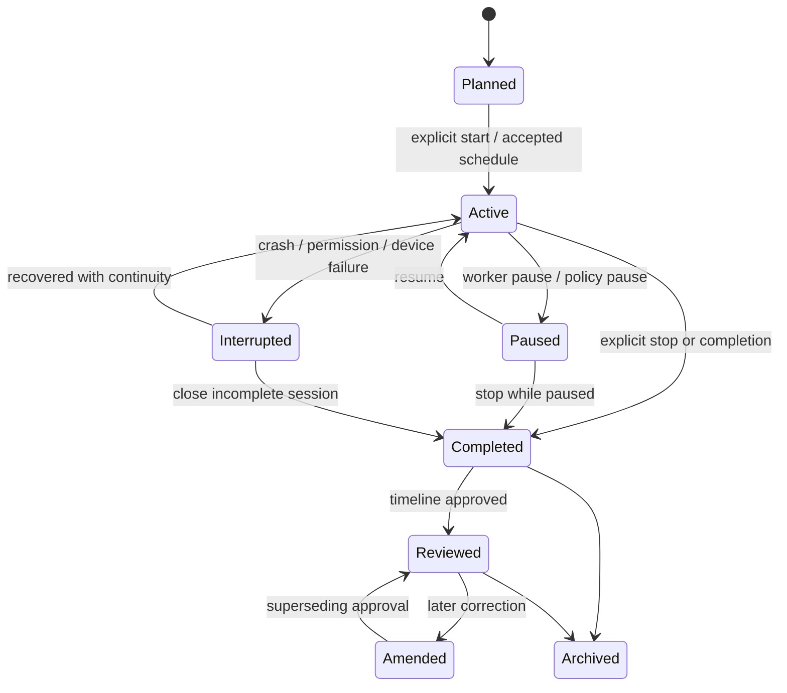
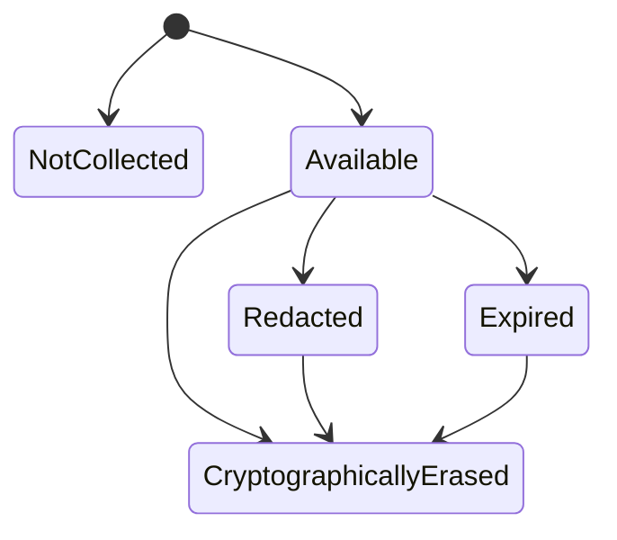
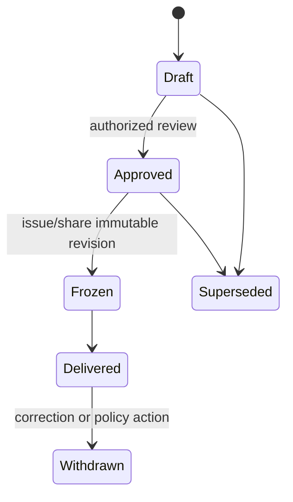
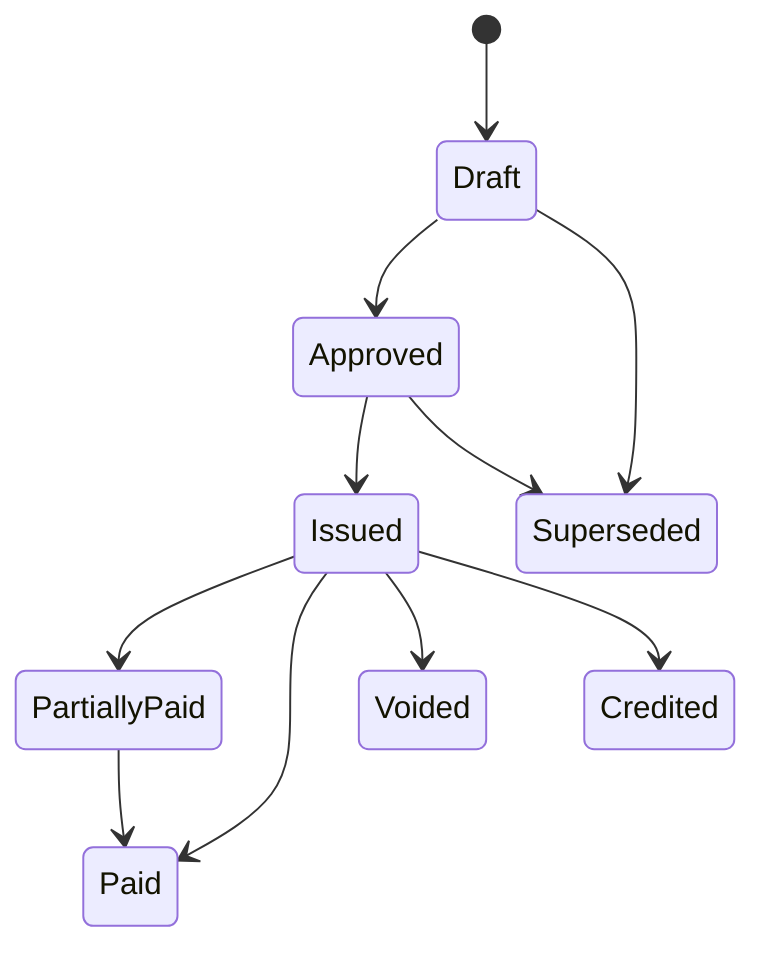

# Domain model

## Purpose

The domain model preserves the difference between what a device observed, what a
rule or model inferred, what a human decided, and what may safely become a
business record. The v1 portable schema and semantic validator live in:

[`apps/sonus-auris-interfaces/incubation/contractor-work-intelligence/v1/`](../../apps/sonus-auris-interfaces/incubation/contractor-work-intelligence/v1/)

This document explains the broader model and the rules future contract versions
must retain.

## Aggregate boundaries

### Organization

Owns business-level policy and billing configuration.

Key concepts:

- organization and legal/business identity;
- roles and memberships;
- workers, subcontractors, crews, and reviewers;
- capture, retention, sharing, and approval policies;
- rate cards and calculation-policy versions;
- export destinations and accounting mappings.

### Customer and site

Represents the recipient and physical or logical place of work.

Key concepts:

- customer account;
- contacts and communication preferences;
- service/billing address separated from precise capture location;
- site, geofence, access notes, and privacy restrictions;
- customer-sharing grants and selected evidence.

### Job and assignment

Represents authorized work and its commercial context.

Key concepts:

- job/work order/contract reference;
- expected schedule and scope;
- assigned worker or crew;
- permitted capture modes;
- rate-card binding;
- fixed-price milestones and change-order policy;
- status: planned, active, paused, completed, canceled, archived.

### Job session

Represents one worker-controlled capture and review period for a job.

A job session is not merely an audio file. It scopes observations, candidates,
reviews, approved time, evidence, synchronization, and generated drafts.

Minimum state machine:



A session may be active while a particular sensor is unavailable. Sensor state is
recorded separately so the system never implies that unavailable evidence exists.

## Record lineage

```text
EvidenceItem
    └── Observation
          └── CandidateActivitySpan
                └── ActivityReviewEvent
                      └── ApprovedTimeEntry
                            ├── ReportStatement
                            └── InvoiceLine
```

An observation may have no evidence item, for example an explicit button press.
A report statement may cite an approved time entry plus an observation. An invoice
line must cite an approved accounting record, not a candidate.

## Evidence item

An evidence item is metadata describing an optional artifact. It does not embed
raw bytes or credentials.

Examples:

- selected audio clip;
- photo;
- receipt image;
- text/voice note;
- location sample or geofence fact;
- imported work-order document.

Important fields:

- stable ID;
- tenant, job, and session scope;
- kind;
- captured and recorded timestamps;
- availability state;
- storage scope;
- opaque locator;
- retention deadline;
- encryption/key version;
- source device and idempotency identity;
- whether the artifact contains raw audio.

Availability state should evolve through append-only events:



`NotCollected` is useful when a policy explicitly disabled an evidence type.
`Expired`, `Redacted`, and `CryptographicallyErased` must not be presented as
interchangeable; each has different operational and legal meaning.

## Observation

An observation is an append-only statement that an input occurred or was measured.
It is not automatically true in every broader interpretation.

Sources include:

- manual controls;
- verbal cues;
- non-speech acoustic classifications;
- location/geofence transitions;
- motion/activity state;
- schedules and calendars;
- photos, receipts, notes, and imported events;
- connected tools or sensors.

Minimum provenance:

- occurrence timestamp and server/device recorded timestamp;
- timezone and original UTC offset;
- monotonic offset when available;
- source kind;
- producer and version;
- device ID;
- idempotency key;
- confidence for probabilistic sources;
- referenced evidence IDs;
- content-minimized payload.

Examples:

- `jobStarted` after the user says a configured phrase and confirms it;
- `breakStarted` after a button press;
- `acousticActivity` with class `powerDrill`, confidence `0.91`;
- `customerDecision` created from a worker-entered note, not silent speaker
  attribution;
- `jobCompleted` after an explicit action.

## Candidate activity span

A candidate span is a model, rule, or hybrid proposal about an interval.

Fields include:

- proposed start/end, timezone, category, and billability;
- confidence;
- source observation IDs;
- inference kind, name, version, and configuration hash;
- alternative categories and confidence;
- optional superseded candidate ID.

Suggested activity vocabulary:

- travel to job;
- onsite preparation;
- active work;
- diagnosis or planning;
- customer discussion;
- materials run;
- break;
- cleanup;
- travel from job;
- administration;
- job complete.

The vocabulary should stay intentionally small during the pilot. Trade-specific
labels may be represented as task tags or notes before they become state-machine
categories.

## Activity review event

A review event is a human decision about a candidate. It is append-only.

Decisions:

- `approve` — accept the proposed interval/category/billability;
- `reject` — deny that the candidate should create approved time;
- `correct` — provide a changed interval, category, or billability.

A later correction references the earlier review through a supersession link.
Historical review events remain available for audit and model evaluation.

A review event must include:

- candidate ID;
- actor ID and authorized role;
- decision;
- human-approved interval when not rejected;
- reason code or optional note;
- occurrence/recorded timestamps;
- device and idempotency identity;
- optional superseded review ID.

## Approved time entry

An approved time entry is an accounting-capable projection derived from
non-rejected human review events.

Durations remain separate:

- `rawDurationSeconds` — union of underlying candidate intervals;
- `approvedDurationSeconds` — duration of the final human-approved interval;
- `billableDurationSeconds` — approved quantity eligible for customer billing;
- `payableDurationSeconds` — approved quantity eligible for worker compensation.

These fields must never be collapsed. A worker might approve a 90-minute work
interval, bill only 60 minutes, and still be payable for all 90 minutes.

Minimum lineage:

- worker ID;
- final start/end/category/timezone;
- candidate IDs;
- review-event IDs;
- projection version;
- rounding policy ID, when a rounding policy is applied;
- approval timestamp;
- source/idempotency identity.

### Approved-time invariants

1. A rejected review cannot produce an approved entry.
2. The final review interval and projected entry interval must match.
3. Billable and payable durations cannot exceed approved duration.
4. Unknown or non-billable review status projects zero billable seconds.
5. Raw duration remains tied to candidate evidence even after a human correction.
6. Two billable entries for the same worker may not overlap unless a documented
   policy explicitly supports concurrent billing and the contract version models it.
7. Deleting raw evidence does not erase the existence of a previously approved
   business record; availability and lineage state must remain explainable.

## Material, expense, and equipment records

These are future contract slices and must follow the same pattern:

```text
Observation or imported evidence
    -> candidate quantity/category
    -> human review
    -> approved material/expense/equipment record
    -> report or invoice line
```

Examples:

- receipt OCR suggests a supplier, date, item, and amount;
- a verbal cue suggests “used two valves”;
- a connected tool suggests equipment runtime;
- the worker confirms quantities, job allocation, cost, markup eligibility, and
  whether an item is customer-billable.

No OCR, acoustic class, or LLM extraction is itself a payable or billable fact.

## Report draft and revision

A report is a versioned collection of grounded statements and selected evidence.

Minimum concepts:

- draft ID and revision number;
- previous revision ID;
- audience/visibility;
- template version;
- generator type/name/version;
- sections and statements;
- source references per statement;
- selected evidence grants;
- author/editor/approver;
- draft, approved, frozen, delivered, withdrawn states.

State model:



An edited report creates a new revision. It must not mutate a delivered revision.

## Invoice draft and revision

An invoice draft is a deterministic projection over approved accounting records
and versioned policies.

Minimum concepts:

- customer, job, and organization;
- revision chain;
- currency;
- line items and source record IDs;
- rate-policy and calculation versions;
- subtotal, tax, discount, deposit/credit, retainage, and total as integer minor
  units;
- status and approval;
- idempotency key;
- export or issue history.

State model:



Only `Draft` exists in incubation v1. Issuance, payment, taxation, credits, and
jurisdiction-specific behavior require later contracts and explicit review.

## Identity and idempotency

Client-generated IDs allow offline creation. Every append operation also needs an
idempotency identity constructed from stable fields such as:

```text
device ID + producer + producer version + idempotency key
```

Server APIs must reject semantic collisions rather than accepting two different
payloads under the same idempotency identity.

Generated projections need their own idempotency keys derived from input revision
IDs and policy versions. Re-running a report or invoice calculation against the
same inputs must not create duplicate business records.

## Timestamps and clock behavior

Each event should preserve:

- `occurredAt` from the device or source;
- `recordedAt` when persisted;
- IANA timezone;
- original UTC offset;
- monotonic offset from the session start when available;
- server receive time as transport metadata.

Wall-clock rollback must not reorder monotonic in-session evidence silently.
Cross-device timelines should surface clock uncertainty rather than invent exact
ordering.

## Conflict model

### Independent observations

Append both. They may corroborate or disagree.

### Candidate spans

Multiple candidates may coexist if produced by different models/versions. A new
candidate may explicitly supersede an earlier one.

### Human review conflicts

Preserve both review events. Mark the projection unresolved and require an
authorized superseding review. Never last-write-wins an approval.

### Report and invoice edits

Use revision chains and optimistic revision tokens. A conflict produces a new
merge/review action; it does not mutate an issued revision.

## Deletion and redaction model

Deletion should be represented with explicit state transitions and scope:

- remove local raw artifact;
- remove synchronized raw artifact;
- redact selected report content;
- revoke a customer-sharing grant;
- cryptographically erase an artifact key;
- delete derived transcript/cache;
- remove a user account under applicable policy;
- preserve minimum audit or accounting metadata where legally required and
  disclosed.

The product must explain what was deleted, what remains, why it remains, and when
completion occurred.

## Contract evolution

- Every portable contract declares an explicit version.
- Backward-compatible optional additions may remain in the same major version.
- Changes in meaning, required state transitions, calculation rules, or privacy
  behavior require a new versioned directory or major version.
- Golden fixtures and negative tests move with the contract.
- Generated Rust, Dart, and TypeScript validators must be reproducible.
- Old records remain interpretable with the producer and contract version that
  created them.
- Migrations must never turn a historical model proposal into a human approval.

## Required semantic tests

Every contract version must test at least:

- candidate-only invoice reference rejection;
- report statement without human-approved grounding rejection;
- rejected review projection rejection;
- non-billable and unknown-billability leakage rejection;
- deterministic amount and total mismatch rejection;
- duplicate invoice basis rejection;
- overlapping billable-time rejection or explicit supported-policy behavior;
- tenant/job/session scope mismatch rejection;
- unknown evidence/reference rejection;
- idempotency collision rejection;
- credential or raw-audio embedding rejection;
- correction preserving raw candidate lineage;
- immutable issued revision behavior when issuance is introduced.