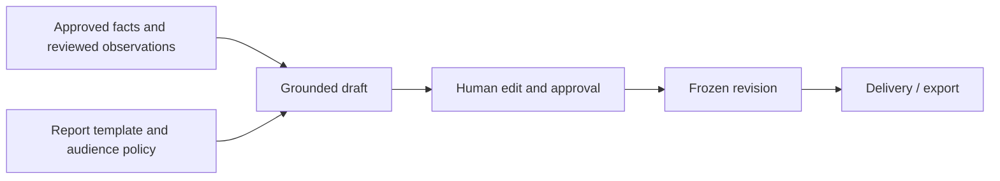
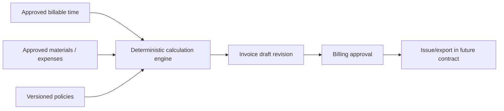

# Reports and billing

## Separation of responsibilities

Generated language and business arithmetic use different trust models:

- **Report drafting** may use deterministic templates and an LLM-assisted layer,
  but every external factual statement must be grounded in approved or
  human-reviewed source records.
- **Billing** uses deterministic, versioned code. A model may suggest a description
  or candidate category, but it cannot decide quantities, rates, taxes, totals,
  payroll, or invoice issuance.

This separation prevents a plausible narrative from becoming an unsupported
accounting record.

## Report types

Initial report types may include:

- daily field report;
- job completion summary;
- customer progress update;
- internal exception/blocker report;
- incident/safety draft;
- change-order evidence packet;
- timesheet summary;
- proof-of-work package.

Each report type declares:

- intended audience;
- required sections;
- permitted source record classes;
- evidence-selection policy;
- required approvals;
- template version;
- delivery/freeze behavior;
- retention classification.

## Grounded statements

A report statement contains:

- human-readable text;
- one or more source references;
- optional author/editor identity;
- generation or template version;
- visibility classification;
- optional confidence/uncertainty language when the statement is intentionally
  probabilistic.

Permitted source classes for an external factual statement are:

- approved time entries;
- non-rejected human review events;
- observations only when paired with a human-approved source or explicitly
  represented as an unconfirmed observation;
- approved material, expense, equipment, customer-decision, or change-order
  records when later contract versions add them.

A model candidate cannot be the sole source for a customer-facing statement.

### Example

Allowed:

> Replaced two kitchen supply valves after diagnosis.
>
> Sources: worker-confirmed note `obs-42`, approved work entry `time-17`.

Not allowed:

> Replaced two kitchen supply valves.
>
> Source: acoustic classifier guessed tool activity.

## Report generation pipeline



The generator should receive a structured source packet, not unrestricted access
to the entire tenant database or raw evidence store.

## Source-packet construction

A source packet should include only records authorized for the report audience:

- job/customer display data;
- approved time summaries;
- selected reviewed notes;
- approved materials/expenses/equipment;
- unresolved blockers that policy permits;
- selected evidence metadata and thumbnails/previews;
- template and policy versions;
- source IDs for every field.

It should exclude:

- unselected raw audio;
- unrelated jobs;
- rejected candidates unless the report explicitly discusses review quality;
- model confidence details intended only for internal review;
- private worker notes;
- credentials or storage locators;
- hidden system prompts or operational logs.

## LLM-assisted report safety

When an LLM is used:

- sanitize source text and treat it as data, not instructions;
- constrain output to a schema;
- require source IDs per statement;
- reject unknown or missing source IDs;
- forbid introducing names, quantities, dates, materials, customer decisions, or
  completion claims absent from the source packet;
- keep the generated result a draft;
- record model/provider/version and prompt-template version;
- avoid sending raw audio when a transcript or worker-confirmed summary suffices;
- provide a deterministic fallback template.

Prompt injection in a receipt, imported document, or transcript must not alter
system policy, source constraints, recipient selection, or billing.

## Editing and revision lineage

A user edit can:

- preserve existing source references when the meaning remains supported;
- add a user-authored source/attestation;
- replace sources;
- mark a sentence internal-only;
- delete the sentence.

It cannot silently detach a factual statement from all approved sources.

Every approved or delivered report is immutable. A correction creates a new
revision with a previous-revision link and an explanation. Withdrawing a report
revokes access where possible but does not rewrite delivery history.

## Timesheets

A timesheet is a projection over approved time entries. It should show:

- worker and job;
- start/end and timezone;
- category;
- raw, approved, payable, and billable duration where the viewer is authorized;
- review/approval identity;
- applicable rounding policy;
- unresolved disputes;
- export status.

Do not regenerate timesheet time from raw observations after approval. Amendments
create superseding approved entries or a versioned timesheet projection.

## Rate cards

A rate card is versioned and effective-dated. It may eventually model:

- hourly labor by worker, role, trade, or service;
- minimum service call;
- travel and mileage;
- overtime, holiday, and after-hours rules;
- fixed-price tasks and milestones;
- materials cost and markup;
- equipment charges;
- discounts;
- taxes;
- deposits, credits, retainage, and change orders.

Every generated line pins:

- rate-policy ID;
- rate-policy version;
- applicable effective date/time;
- source approved record IDs;
- quantity and unit;
- rounding/calculation policy;
- calculation-engine version.

Missing or ambiguous policy blocks the affected line. The system must not silently
choose a default rate.

## Monetary representation

Use integer minor currency units for stored and calculated money. Do not use
binary floating point for amounts.

For currencies with a standard minor unit, examples are cents, pence, or centavos.
Currency metadata must handle zero- and three-decimal currencies in later
versions; do not assume every currency has two decimals in generic code.

Incubation v1 labor calculation:

```text
amountMinor = round-half-up(
  billableDurationSeconds × rateMinorPerHour / 3600
)
```

Equivalent integer implementation:

```text
numerator = durationSeconds × rateMinorPerHour
amountMinor = floor((numerator + 1800) / 3600)
```

The implementation must use an integer width that cannot overflow supported
inputs and must reject values outside defined bounds.

## Example

Approved billable time: 5,400 seconds (1.5 hours)

Rate: USD 95.00/hour = 9,500 minor units/hour

```text
amount = round-half-up(5400 × 9500 / 3600)
       = 14,250 minor units
       = USD 142.50
```

The line stores the 5,400-second quantity, 9,500 rate, policy identity/version,
rounding policy, source approved-time ID, and 14,250 result.

## Invoice draft generation



Invoice generation must be idempotent for the same input revisions and calculation
version.

## Invoice-line invariants

- labor lines reference approved time entries, not observations/candidates;
- material/expense/equipment lines reference approved records;
- one approved source cannot be billed twice in the same draft unless the policy
  explicitly models allocation and the allocations sum correctly;
- duration/quantity equals the approved billable quantity or records an explicit
  authorized adjustment;
- rate and policy version are present;
- amount matches deterministic calculation;
- subtotal equals line amounts;
- total equals subtotal plus tax and charges minus discounts/credits;
- total cannot become negative unless a future credit-note contract explicitly
  supports it;
- currency is consistent across the draft;
- draft revision and idempotency identity are unique;
- a changed source record or policy creates a new draft revision.

## Manual adjustments

Manual adjustments are business records, not arbitrary overwritten totals. They
must include:

- reason code and optional explanation;
- actor and approval;
- amount/quantity and currency/unit;
- whether the adjustment is taxable;
- source contract/change order/customer authorization where applicable;
- creation and revision timestamps.

The UI should prefer adjusting approved source records or policies over opaque
invoice-only overrides.

## Taxes and jurisdiction

Tax calculation is outside incubation v1. When added:

- use a versioned tax provider or deterministic configured rule;
- store jurisdiction and evidence for the tax decision;
- separate inclusive/exclusive taxes;
- handle exemptions and tax IDs;
- record provider response/version where external;
- never ask an LLM to infer tax treatment;
- label drafts as not tax advice and require business review.

## Fixed-price work

Fixed-price billing still needs approved lineage. A line may reference:

- approved milestone completion;
- signed contract schedule;
- approved change order;
- customer acceptance;
- authorized manual milestone adjustment.

Time observations may support the report but do not automatically alter a fixed
price.

## Change orders

A change-order draft can be assembled from:

- worker-confirmed customer request;
- unexpected condition note/photo;
- approved additional time/material estimate;
- contract scope reference;
- selected evidence;
- customer approval state.

The generated draft remains unapproved until an authorized human and, when
required, the customer accepts it. Audio alone is not customer consent.

## Payroll boundary

Approved payable time may be exported in a later phase, but payroll remains a
separate consequence domain. Requirements include:

- explicit payable-time approval;
- jurisdiction and employment-policy rules;
- worker access and dispute window;
- immutable export revisions;
- reconciliation with downstream payroll acceptance;
- no deductions or unpaid breaks inferred from sensors alone.

A billable duration and a payable duration are not necessarily equal.

## Customer presentation

Customer-facing invoices and reports should include concise lineage explanations,
not internal model telemetry. Examples:

- “3.25 approved labor hours” with a link to the selected job summary;
- “Two replacement valves” with selected receipt/photo if shared;
- “Change order approved on 31 July 2026” with the approval record.

Do not expose raw confidence scores, rejected candidates, other workers' timelines,
or unrelated evidence.

## Export behavior

Exports are versioned artifacts:

- PDF for human review and delivery;
- CSV for approved time or line items;
- JSON for portable lineage and integrations;
- accounting-specific adapters in later phases.

Every export records:

- source report/invoice/timesheet revision;
- exporter/version;
- actor;
- timestamp;
- destination;
- checksum where appropriate;
- delivery result.

Regenerating a PDF for the same frozen revision should not change factual content.

## Golden tests

The billing/report suite should include:

- exact integer labor examples at rounding boundaries;
- zero, minimum, and maximum supported durations/rates;
- currencies with different minor-unit scales when supported;
- daylight-saving and timezone boundaries without changing duration arithmetic;
- corrected approved time distinct from raw candidate duration;
- non-billable and unknown time excluded from billing;
- duplicate source billing rejected;
- missing rate policy blocked;
- stale rate version creates new revision;
- report observation-only grounding rejected;
- rejected review unable to ground a report;
- edited sentence requiring source revalidation;
- idempotent draft regeneration;
- source deletion/redaction reflected without rewriting frozen revision history;
- cross-runtime Rust/Dart/TypeScript vectors producing identical results.

## Review checklist

Before approving a report or invoice feature:

1. What record class is the source?
2. Who reviewed or approved it?
3. Can a model candidate bypass that approval?
4. Is the external statement grounded?
5. Is every quantity deterministic and versioned?
6. Can the same source be billed twice?
7. Are revisions immutable after issue/delivery?
8. What happens when evidence expires or is redacted?
9. Can the worker see the correction and export lineage?
10. Can support diagnose a mismatch without raw customer or audio content?