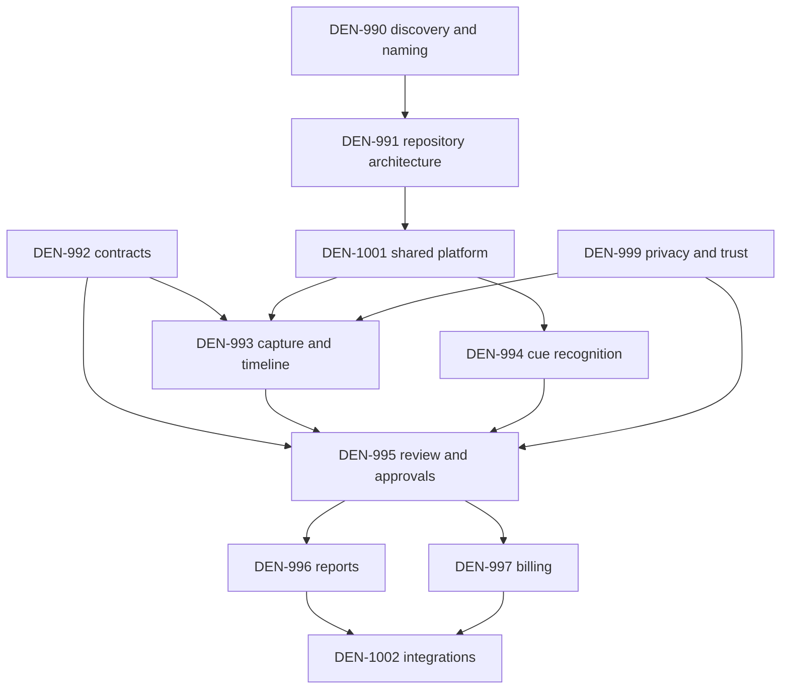

# Roadmap

## Planning assumptions

- The working category remains **Contractor Work Intelligence** until DEN-990
  chooses a launch vertical, buyer, pricing model, and final name.
- The sister product remains separate from Sonus Auris at the product, database,
  deployment, credential, app-store, and organizational boundaries.
- Shared capture, cue, provenance, crypto, retention, and sync capabilities are
  extracted behind versioned contracts rather than copied or imported directly.
- The first pilot is narrow. General field-service breadth follows validated value
  and trust, not speculative repository or classifier proliferation.

## Phase 0 — discovery and boundary validation

**Primary Linear ownership:** DEN-990, DEN-991, DEN-989.

Deliverables:

- interview 15–30 contractors across candidate trades;
- select one launch vertical and document why alternatives lost;
- identify worker, owner/operator, manager, bookkeeper, and customer workflows;
- measure current time/report/invoice reconstruction cost;
- choose pricing and storage assumptions;
- validate willingness to use visible job-scoped capture;
- select final product name and GitHub organization;
- document pilot jurisdictions and legal/trust constraints;
- create the final repository map only after the above decisions.

Exit criteria:

- one launch segment with repeated, quantified pain;
- a product promise that does not depend on covert monitoring;
- an owner-operator or small-crew pilot cohort;
- approved product name and domain/repository slug;
- written architecture and data-separation decision.

## Phase 1 — portable contract and deterministic core

**Primary Linear ownership:** DEN-992, DEN-997, DEN-1001.

Current status:

- incubation v1 ledger schema, semantic validator, golden fixture, and negative
  accounting/privacy tests are merged in `sonus-auris-interfaces`;
- this handbook defines broader states and future slices.

Remaining deliverables:

- generated Rust, Dart, and TypeScript validators;
- event envelope and offline sync contract;
- organization/customer/site/job/session contracts;
- approved material, expense, and equipment records;
- rate-card and calculation-policy contracts;
- report and invoice revision states;
- retention/redaction/deletion events;
- contract compatibility and migration tests;
- pure Rust calculation engine with cross-runtime golden vectors.

Exit criteria:

- every consequence-bearing record has explicit human approval lineage;
- candidate-only billing/report tests fail closed;
- contract generation is reproducible;
- Rust/Dart/TypeScript agree on fixtures and calculations;
- no production Sonus table or credential is shared.

## Phase 2 — local-first field prototype

**Primary Linear ownership:** DEN-993, DEN-994, DEN-995, DEN-999, DEN-1001.

Deliverables:

- Flutter mobile prototype with cached jobs;
- explicit job start/pause/resume/stop;
- visible sensor and retention state;
- encrypted SQLite event ledger;
- manual notes, photos, receipts, and evidence clips;
- small configurable verbal cue vocabulary;
- one or two pilot-trade acoustic observations;
- offline candidate timeline;
- split, merge, relabel, reject, redact, and approve flows;
- conservative crash and microphone-failure recovery;
- local export for debugging and user access;
- battery/storage instrumentation.

Exit criteria:

- a representative job can be captured and reviewed fully offline;
- no acknowledged event is lost across recoverable restarts;
- a false acoustic cue has no business consequence before review;
- workers can identify active sensors and stop capture immediately;
- retention and deletion pass interruption tests;
- review burden is measured on real or realistic jobs.

## Phase 3 — synchronized multi-user workflow

**Primary Linear ownership:** DEN-993, DEN-995, DEN-999, DEN-1002.

Deliverables:

- authenticated Rust API and trusted devices;
- append-only synchronization with idempotency and per-device cursors;
- organization, roles, assignments, jobs, and policies;
- worker/reviewer conflict model;
- approved-time projections;
- selective encrypted evidence upload;
- worker record access and export;
- customer-sharing grants;
- privacy-safe observability and support bundles;
- tenant/job/session authorization matrix.

Exit criteria:

- offline-created sessions synchronize without duplicates;
- concurrent reviews preserve both decisions and require supersession;
- cross-tenant and cross-job access tests pass;
- manager/customer views cannot access unselected raw evidence;
- deletion/redaction propagates to defined stores and indexes;
- support can diagnose common failures without raw content.

## Phase 4 — reports and invoice drafts

**Primary Linear ownership:** DEN-996, DEN-997.

Deliverables:

- one deterministic daily field-report template;
- source packet and grounded-statement validator;
- optional LLM-assisted drafting behind schema/source constraints;
- editable report revisions and immutable frozen revisions;
- approved time summary;
- hourly and one fixed-price invoice-draft path;
- rate-card versions and missing-policy blocks;
- deterministic integer-minor-unit calculations;
- PDF/CSV/JSON exports;
- selected evidence preview and delivery history.

Exit criteria:

- every external statement has a human-approved source;
- an LLM cannot invent a quantity, customer decision, material, or completion fact;
- invoice regeneration is idempotent;
- duplicate source billing is rejected;
- cross-runtime calculation vectors match;
- a worker/owner can complete report and invoice review in the pilot target time.

## Phase 5 — owner-operator design-partner pilot

**Primary Linear ownership:** DEN-989 plus all active child issues.

Scope:

- 5–10 consenting owner-operators or very small businesses;
- one trade or tightly related service category;
- no automatic payroll, payment, discipline, or broad ERP integration;
- direct support and weekly interviews.

Metrics:

- time from job completion to approved report/invoice draft;
- minutes saved versus prior workflow;
- recovered billable work/materials confirmed by the user;
- candidate correction/rejection burden;
- worker trust and capture pause/opt-out behavior;
- crash-free/offline recovery rate;
- battery, storage, transcription/inference cost;
- customer usefulness and dispute rate.

Exit criteria:

- repeated weekly use;
- measurable administrative time savings;
- acceptable review burden;
- no critical trust or privacy pattern;
- sustainable support and infrastructure cost;
- clear evidence for, or against, expanding to crews.

## Phase 6 — small-crew pilot

Deliverables:

- worker and manager roles;
- manager corrections and worker acknowledgment/dispute;
- crew timecards;
- assignment and policy management;
- customer report delivery;
- bookkeeper/billing workflow;
- independent worker-trust research;
- role-scoped observability and support.

Exit criteria:

- workers understand and accept the capture/review model;
- manager actions are visible and auditable;
- no sensor-only wage or discipline consequence;
- approval latency and conflicts are manageable;
- customer-sharing permissions remain narrow;
- jurisdictional review supports the deployment model.

## Phase 7 — limited availability

Potential additions, only after pilot evidence:

- approved materials, receipts, expenses, and equipment;
- change-order workflow;
- customer attestations/signatures;
- QuickBooks/Xero or other narrow accounting exports;
- calendar/dispatch imports;
- trade-specific report templates;
- optional model personalization;
- web/desktop review console;
- organization-level retention packages.

Still excluded by default:

- generalized employee surveillance;
- speaker/emotion/productivity scoring;
- automatic payroll deductions;
- unreviewed invoice issuance;
- broad integrations without customer demand and support capacity.

## Final organization extraction

After DEN-990 resolves naming:

1. Create the final GitHub organization.
2. Create `<slug>-app`, `<slug>-api.rs`, `<slug>-interfaces`, and `<slug>-infra`.
3. Add `<slug>-site.web` only if marketing/customer portal release boundaries
   justify it.
4. Extract the incubation contract while preserving Git history or an auditable
   provenance trail, golden fixtures, and tests.
5. Publish neutral Sonus shared packages with explicit versions.
6. Replace repository-relative imports with package/API dependencies.
7. Create separate cloud projects, database, buckets, keys, OAuth apps, bundle
   IDs, signing identities, observability, backups, and incident ownership.
8. Move or cross-link Linear child issues to the final dedicated project without
   losing relations or implementation history.
9. Remove/archive temporary adapters only after compatibility tests pass.
10. Update this handbook's canonical links or move the handbook into the final
    docs repository with redirects from the incubation location.

## Dependency map

## Work-item readiness checklist

An implementation issue is ready when it states:

- user and consequence domain;
- source and target record classes;
- approval/authorization boundary;
- offline behavior;
- failure behavior;
- privacy collection, retention, sharing, and deletion;
- contract/API version impact;
- test matrix and observability;
- documentation files to update;
- explicit non-goals.

## Release readiness checklist

A release candidate must have:

- final-head CI that actually executed;
- reproducible contract/client generation;
- migration and rollback plan;
- cross-tenant security results;
- offline and crash-recovery results;
- retention/deletion evidence;
- deterministic billing vectors;
- report-grounding results;
- model evaluation cards;
- worker-facing policy and help content;
- incident response and support playbooks;
- pilot/rollout scope and kill switches;
- updated handbook and ADRs.

## Documentation maintenance roadmap

- Treat this handbook as the product/engineering baseline during incubation.
- Add API examples when OpenAPI endpoints exist.
- Add sequence diagrams for sync, deletion, sharing, and disputes as implemented.
- Add screenshots only after flows are real; avoid mockups that imply shipped
  behavior.
- Add model cards and privacy impact assessments per pilot.
- Record each irreversible architecture or policy choice as an ADR.
- Move the handbook to the final sister-product repository after extraction,
  preserving links from the Sonus incubation docs.