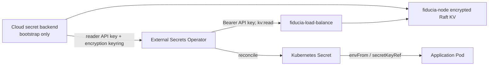

# Fiducia KV to container environment variables

The cluster can use fiducia.cloud as a second External Secrets backend. Applications do not call
Fiducia directly and never place values in Git: External Secrets Operator (ESO) reads one Fiducia
KV key per requested Kubernetes Secret key, then workloads use the ordinary `envFrom` or
`secretKeyRef` contract.



The platform resources live in `remote/argocd/secrets/common/fiducia-webhook.yaml` and
`remote/argocd/fiducia/fiducia-kv-protection.externalsecret.yaml`:

- `ExternalSecret/external-secrets/fiducia-eso-reader` bootstraps a read-only Fiducia API key from
  `dd/remote-dev/fiducia-eso-reader` in the selected cloud store.
- `ExternalSecret/fiducia/fiducia-kv-protection` bootstraps the versioned AES-256-GCM keyring from
  `dd/remote-dev/fiducia-kv-protection`. Fiducia seals values before they enter the Raft log.
- `ClusterSecretStore/dd-fiducia-kv` calls the in-cluster Fiducia load balancer and extracts
  `$.entry.value` from `GET /v1/kv?key=...`.

The cloud store is deliberately the bootstrap root. Storing the Fiducia reader credential or its
encryption key inside Fiducia would create a circular dependency after a cold start or key loss.

## Bootstrap once

Complete this before syncing the Fiducia StatefulSet change. The node manifest now requires the
encryption keyring; a missing keyring keeps the pods Pending instead of letting them write secrets
to Raft in plaintext.

1. Create a dedicated Fiducia organization for this cluster. This is the current keyspace boundary;
   a `kv:read` API key can read every KV value in its organization, so do not share the organization
   with unrelated customer configuration.
2. Through the authenticated Fiducia customer BFF, create an API key named
   `external-secrets-reader` with only the `kv:read` scope. The underlying auth endpoint is
   `POST /v1/keys` with `{"name":"external-secrets-reader","org_id":"<cluster-org>","scopes":["kv:read"],"env":"live"}`
   plus a Supabase bearer session and `Idempotency-Key`. Capture the returned `api_key` once.
3. In the selected cloud secret backend, create `dd/remote-dev/fiducia-eso-reader` with this JSON
   shape (replace the placeholder through the backend's protected input, never in Git or shell
   history):

   ```json
   {"FIDUCIA_API_KEY":"<fdc_live_...>"}
   ```

4. Generate a random 32-byte AES key, base64-encode it, and create
   `dd/remote-dev/fiducia-kv-protection` with a versioned keyring:

   ```json
   {
     "FIDUCIA_KV_ENCRYPTION_KEYS":"{\"k-2026-01\":\"<base64-32-byte-key>\"}",
     "FIDUCIA_KV_ENCRYPTION_ACTIVE_KEY_ID":"k-2026-01"
   }
   ```

   The outer value for `FIDUCIA_KV_ENCRYPTION_KEYS` is a JSON string because the cloud object holds
   environment-variable-shaped strings; after ESO projects it, Fiducia receives the inner JSON
   object exactly as required by `fiducia-node`.
5. Sync in order: `external-secrets-operator`, `dd-secret-store`, `dd-secrets`, then `fiducia`.
   Confirm both bootstrap `ExternalSecret`s are Ready, `ClusterSecretStore/dd-fiducia-kv` is Ready,
   and all `fiducia-node` replicas report KV encryption enabled before writing application secrets.
   The Fiducia application creates its destination namespace first; its `-1` sync wave then waits
   for `fiducia-kv-protection` before creating node pods.

The API key and the encryption keyring are different credentials and stay in separate cloud
objects. Rotating one does not broaden or invalidate the other.

## Put an application value into Fiducia

Use a different operator credential with `kv:write`; never give ESO write scope. The recommended key
shape is `k8s/<namespace>/<workload>/<ENV_VAR>`. The cluster-dedicated Fiducia organization already
provides the tenant prefix.

Prefer the `fiducia` CLI or an authenticated admin UI. For the HTTP API, keep the value off the
command line and shell history:

```bash
set +x
read -r -s -p 'Secret value: ' SECRET_VALUE; printf '\n'
printf '%s' "$SECRET_VALUE" \
  | jq -Rs '{value: .}' \
  | curl --fail-with-body --silent --show-error \
      -X PUT "${FIDUCIA_URL%/}/v1/kv?key=k8s/default/example-api/DATABASE_URL" \
      -H "Authorization: Bearer ${FIDUCIA_WRITER_API_KEY}" \
      -H "Idempotency-Key: $(openssl rand -hex 24)" \
      -H 'Content-Type: application/json' \
      --data-binary @- >/dev/null
unset SECRET_VALUE
```

Keep the URL key to letters, digits, dots, underscores, hyphens, and slashes. The store URL-encodes
the `remoteRef.key`, but a conservative key grammar keeps CLI, audit, and policy tooling predictable.

## Materialize it and inject it

Commit an app-owned, namespace-scoped `ExternalSecret`:

```yaml
apiVersion: external-secrets.io/v1
kind: ExternalSecret
metadata:
  name: example-api-secrets
  namespace: default
spec:
  refreshInterval: 5m
  secretStoreRef:
    kind: ClusterSecretStore
    name: dd-fiducia-kv
  target:
    name: example-api-secrets
    creationPolicy: Owner
    deletionPolicy: Retain
  data:
    - secretKey: DATABASE_URL
      remoteRef:
        key: k8s/default/example-api/DATABASE_URL
    - secretKey: THIRD_PARTY_API_KEY
      remoteRef:
        key: k8s/default/example-api/THIRD_PARTY_API_KEY
```

Then reference the generated Kubernetes Secret:

```yaml
apiVersion: apps/v1
kind: Deployment
metadata:
  name: example-api
  namespace: default
  annotations:
    secret.reloader.stakater.com/reload: example-api-secrets
spec:
  template:
    spec:
      containers:
        - name: app
          image: example.invalid/example-api:replace-me
          envFrom:
            - secretRef:
                name: example-api-secrets
```

Use individual `secretKeyRef` entries instead of `envFrom` when the container should receive only a
subset. The Reloader annotation rolls the Deployment when ESO changes the Kubernetes Secret;
without it, environment variables do not change until the pod restarts.

## Failure and rotation behavior

- Retrieval is fail-closed: a missing/unauthorized Fiducia key or malformed response makes the
  `ExternalSecret` NotReady. With `deletionPolicy: Retain`, the last Kubernetes value remains until
  an operator deliberately replaces or deletes it. Monitor NotReady conditions and ESO errors.
- The target Kubernetes Secret is still a Kubernetes Secret, not an HSM. Restrict `get/list` on
  Secrets, pod `exec`, debug containers, and `ExternalSecret` creation. Anyone allowed to create an
  `ExternalSecret` referencing this cluster-wide store could request another key in the same
  Fiducia organization.
- Rotate the ESO API key by rotating it in Fiducia, replacing `FIDUCIA_API_KEY` in the bootstrap
  backend, and waiting for `fiducia-eso-reader` plus `dd-fiducia-kv` to become Ready.
- Rotate encryption by adding a new key ID to `FIDUCIA_KV_ENCRYPTION_KEYS`, retaining every old key,
  then changing `FIDUCIA_KV_ENCRYPTION_ACTIVE_KEY_ID`. Roll one Fiducia node at a time. Rewrite
  long-lived values before removing an old key ID; deleting a key still referenced by ciphertext
  makes those values unreadable by design.
- For high-churn values or applications that cannot restart, use a mounted secret/config client
  instead of environment variables. This pathway intentionally follows Kubernetes' process-start
  environment model.
