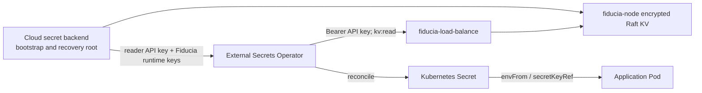

# Fiducia KV to container environment variables

The supported cluster contract uses fiducia.cloud as a second External Secrets backend. Application
workloads should not call Fiducia directly and never place values in Git: External Secrets Operator
(ESO) reads one Fiducia KV key per requested Kubernetes Secret key, then workloads use the ordinary
`envFrom` or `secretKeyRef` contract.


```mermaid
flowchart LR
  A["Cloud secret backend<br/>bootstrap and recovery root"] -->|"reader API key + Fiducia runtime keys"| E["External Secrets Operator"]
  A --> N["fiducia-node encrypted Raft KV"]
  E -->|"Bearer API key; kv:read"| L["fiducia-load-balance"]
  L --> N
  E -->|"reconcile"| K["Kubernetes Secret"]
  K -->|"envFrom / secretKeyRef"| P["Application Pod"]
```

The platform resources live in `remote/argocd/secrets/common/fiducia-webhook.yaml`,
`remote/argocd/secrets/common/fiducia-external-secret-policy.yaml`, and
`remote/argocd/fiducia/`:

- `ExternalSecret/external-secrets/fiducia-eso-reader` bootstraps a read-only Fiducia API key from
  `dd/remote-dev/fiducia-eso-reader` in the selected cloud store.
- `ExternalSecret/fiducia/fiducia-kv-protection` bootstraps the versioned AES-256-GCM keyring from
  `dd/remote-dev/fiducia-kv-protection`. Fiducia seals values before they enter the Raft log.
- `fiducia-runtime-secrets.externalsecret.yaml` bootstraps the trust, JWT, pepper, Supabase, database,
  and CSRF material that Fiducia itself requires. These values stay in the independent cloud
  recovery root to avoid a circular dependency.
- `ClusterSecretStore/dd-fiducia-kv` calls the in-cluster Fiducia load balancer and extracts
  `$.entry.value` from `GET /v1/kv?key=...`.
- The store is usable only from namespaces labelled `dd.dev/fiducia-kv-secrets=enabled`.
- `ValidatingAdmissionPolicy/dd-fiducia-kv-external-secret-guard` permits only Argo CD or cluster
  administrators to author Fiducia-backed `ExternalSecret` objects, rejects `dataFrom`, requires
  `Owner` plus `Retain`, and enforces the exact
  `k8s/<namespace>/<annotated-workload>/<ENV_VAR>` key grammar.

The cloud store is deliberately the bootstrap root. Storing the Fiducia reader credential,
encryption key, trusted-hop secret, signing key, or key-hashing pepper inside Fiducia would create a
circular dependency after a cold start, storage loss, or key loss.

## Audit inventory as of 2026-07-27

The repository defines the Fiducia-backed `ClusterSecretStore`, but main currently has no active
application-owned `ExternalSecret` that references `dd-fiducia-kv`. The audited direct callers are:

- `fiducia-auth`, which persists API-key records in Fiducia KV. This is a platform-internal data path,
  not application secret injection. Its Rust client must present the load balancer's verified
  trusted-hop identity with only `kv:read kv:write`; an internal node header alone is not an LB
  identity.
- `dd-fabrication-server`, which contains a legacy, optional allowlisted overlay for
  `secrets/daedalus/{NATS_URL,NATS_TOKEN,NATS_NKEY}`. It is scaled to zero and remains explicitly
  network-allowlisted only for migration compatibility. Move it to the ESO contract before enabling
  production replicas so the application no longer holds a Fiducia API key.
- `dd-build-server`, `dd-contract-service`, and `dd-billing-server`, which use Fiducia for leases,
  fencing, or idempotency coordination rather than for secret delivery.

Do not add another direct application KV client. Add a reviewed `ExternalSecret` under GitOps and
let ESO be the only application-secret reader.

## Bootstrap once

Complete this before syncing the hardened Fiducia deployment. Missing required material now keeps
pods Pending or makes the service fail startup rather than silently disabling authentication,
trusted-hop checks, persistence, or customer identity synchronization.

1. Create a dedicated Fiducia organization for this cluster. This is the current server-side
   keyspace boundary; a `kv:read` API key can read every KV value in its organization, so do not
   share the organization with unrelated customer configuration.
2. Through the authenticated Fiducia customer BFF, create an API key named
   `external-secrets-reader` with only the `kv:read` scope. The underlying auth endpoint is
   `POST /v1/keys` with
   `{"name":"external-secrets-reader","org_id":"<cluster-org>","scopes":["kv:read"],"env":"live"}`
   plus a Supabase bearer session and `Idempotency-Key`. Capture the returned `api_key` once.
3. In the selected cloud secret backend, create `dd/remote-dev/fiducia-eso-reader` with this JSON
   shape (replace the placeholder through the backend's protected input, never in Git or shell
   history):

   ```json
   {"FIDUCIA_API_KEY":"<fdc_live_...>"}
   ```

4. Generate a random 32-byte AES key, base64-encode it, and create
   `dd/remote-dev/fiducia-kv-protection` with a versioned keyring:

   ```json
   {
     "FIDUCIA_KV_ENCRYPTION_KEYS":"{\"k-2026-01\":\"<base64-32-byte-key>\"}",
     "FIDUCIA_KV_ENCRYPTION_ACTIVE_KEY_ID":"k-2026-01"
   }
   ```

   The outer value for `FIDUCIA_KV_ENCRYPTION_KEYS` is a JSON string because the cloud object holds
   environment-variable-shaped strings; after ESO projects it, Fiducia receives the inner JSON
   object exactly as required by `fiducia-node`.
5. Create the following cloud objects with the exact properties enumerated in
   `fiducia-runtime-secrets.externalsecret.yaml`:

   - `dd/remote-dev/fiducia-cluster-secrets`: `FIDUCIA_INTERNAL_SECRET` and
     `FIDUCIA_BRAIN_RAFT_SECRET`, each independently generated with at least 32 random bytes.
   - `dd/remote-dev/fiducia-auth-secrets`: an ES256 P-256 PKCS#8
     `FIDUCIA_JWT_SIGNING_KEY`, `FIDUCIA_INTROSPECT_SECRET`,
     `FIDUCIA_KEY_IDEMPOTENCY_SECRET`, `CUSTOMER_API_KEY_PEPPER`, `SUPABASE_URL`,
     `SUPABASE_PUBLISHABLE_KEY`, and `SUPABASE_SERVICE_ROLE_KEY`. The idempotency secret and pepper
     must each contain at least 32 bytes and no whitespace.
   - `dd/remote-dev/fiducia-backend-secrets`: `DATABASE_URL`, `SUPABASE_URL`,
     `SUPABASE_PUBLISHABLE_KEY`, and `FIDUCIA_CUSTOMER_CSRF_SECRET`.
   - `dd/remote-dev/fiducia-admin-secrets`: `FIDUCIA_ADMIN_CSRF_SECRET`, `DATABASE_URL`,
     `SUPABASE_URL`, and `SUPABASE_PUBLISHABLE_KEY`.
6. Sync in order: `external-secrets-operator`, `dd-secret-store`, `dd-secrets`, then `fiducia`.
   Confirm all bootstrap `ExternalSecret` objects are Ready, `ClusterSecretStore/dd-fiducia-kv` is
   Ready, and every Fiducia pod reports its required authentication/encryption configuration before
   writing application secrets. The `-1` sync wave orders bootstrap resources before workloads, but
   operators must still verify the resulting Kubernetes Secrets exist.

The API key, runtime trust keys, and encryption keyring are different credentials and stay in
separate cloud objects. Rotating one must not broaden or invalidate another unintentionally.

## Put an application value into Fiducia

Use a different operator credential with `kv:write`; never give ESO write scope. The required key
shape is `k8s/<namespace>/<workload>/<ENV_VAR>`. The cluster-dedicated Fiducia organization already
provides the tenant boundary.

Prefer the `fiducia` CLI or an authenticated admin UI. For the HTTP API, keep the value off the
command line and shell history:

```bash
set +x
read -r -s -p 'Secret value: ' SECRET_VALUE; printf '\n'
printf '%s' "$SECRET_VALUE" \
  | jq -Rs '{value: .}' \
  | curl --fail-with-body --silent --show-error \
      -X PUT "${FIDUCIA_URL%/}/v1/kv?key=k8s/default/example-api/DATABASE_URL" \
      -H "Authorization: Bearer ${FIDUCIA_WRITER_API_KEY}" \
      -H "Idempotency-Key: $(openssl rand -hex 24)" \
      -H 'Content-Type: application/json' \
      --data-binary @- >/dev/null
unset SECRET_VALUE
```

Keep names within the admission-policy grammar: DNS-label namespace and workload segments, followed
by an uppercase environment-variable name.

## Materialize it and inject it

Commit an app-owned `ExternalSecret`. Argo CD is the author seen by admission control; the workload
annotation binds the target name and remote key prefix:

```yaml
apiVersion: external-secrets.io/v1
kind: ExternalSecret
metadata:
  name: example-api-secrets
  namespace: default
  annotations:
    dd.dev/fiducia-workload: example-api
spec:
  refreshInterval: 5m
  secretStoreRef:
    kind: ClusterSecretStore
    name: dd-fiducia-kv
  target:
    name: example-api-secrets
    creationPolicy: Owner
    deletionPolicy: Retain
  data:
    - secretKey: DATABASE_URL
      remoteRef:
        key: k8s/default/example-api/DATABASE_URL
    - secretKey: THIRD_PARTY_API_KEY
      remoteRef:
        key: k8s/default/example-api/THIRD_PARTY_API_KEY
```

Then reference the generated Kubernetes Secret:

```yaml
apiVersion: apps/v1
kind: Deployment
metadata:
  name: example-api
  namespace: default
  annotations:
    secret.reloader.stakater.com/reload: example-api-secrets
spec:
  template:
    spec:
      containers:
        - name: app
          image: example.invalid/example-api:replace-me
          envFrom:
            - secretRef:
                name: example-api-secrets
```

Use individual `secretKeyRef` entries instead of `envFrom` when the container should receive only a
subset. The Reloader annotation rolls the Deployment when ESO changes the Kubernetes Secret;
without it, environment variables do not change until the pod restarts.

## Failure and rotation behavior

- Retrieval is fail-closed: a missing/unauthorized Fiducia key or malformed response makes the
  `ExternalSecret` NotReady. With `deletionPolicy: Retain`, the last Kubernetes value remains until
  an operator deliberately replaces or deletes it. Monitor NotReady conditions and ESO errors.
- The target Kubernetes Secret is still a Kubernetes Secret, not an HSM. Restrict `get/list` on
  Secrets, pod `exec`, and debug containers. The admission policy prevents ordinary namespace users
  from creating a Fiducia-backed `ExternalSecret`, but the shared reader credential still has
  organization-wide `kv:read`; server-side path-scoped credentials remain future work.
- Rotate the ESO API key by rotating it in Fiducia, replacing `FIDUCIA_API_KEY` in the bootstrap
  backend, and waiting for `fiducia-eso-reader` plus `dd-fiducia-kv` to become Ready.
- Rotate the internal trusted-hop secret as a coordinated two-key rollout; replacing it in one step
  disconnects components that have not restarted. Add dual-secret verification in Fiducia before
  attempting zero-downtime rotation.
- Rotate encryption by adding a new key ID to `FIDUCIA_KV_ENCRYPTION_KEYS`, retaining every old key,
  then changing `FIDUCIA_KV_ENCRYPTION_ACTIVE_KEY_ID`. Roll one Fiducia node at a time. Rewrite
  long-lived values before removing an old key ID; deleting a key still referenced by ciphertext
  makes those values unreadable by design.
- For high-churn values or applications that cannot restart, use a mounted secret/config client
  instead of environment variables. This pathway intentionally follows Kubernetes' process-start
  environment model.

## Durability and transport boundaries

The current development-cluster `fiducia-node` StatefulSet mounts `/var/lib/fiducia` from an
`emptyDir`. ESO retains the last successfully synchronized Kubernetes Secret, but that is not a
backup of the Fiducia key/value store. Until the cluster uses PVC-backed Raft storage and tested,
restorable backups, keep a recoverable source for every value and do not treat this pathway as the
sole disaster-recovery copy. Migrate the data under change control; replacing the existing
StatefulSet volume shape is not an in-place rollout.

ESO and in-cluster clients currently reach the load balancer over HTTP. NetworkPolicy limits the
reachable pods and application-layer credentials remain mandatory, but the bearer token and secret
payload are not transport-encrypted between pods. The load balancer supports TLS; production rollout
requires a cluster CA/certificate Secret, ESO `caProvider`, HTTPS endpoints for every client, and a
staged HTTP-to-HTTPS migration with rollback tests.
