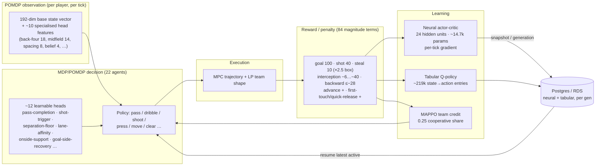
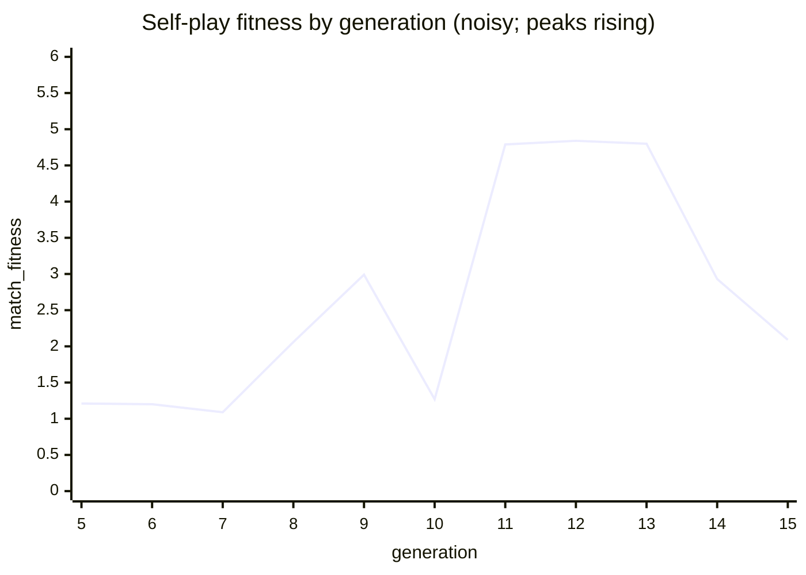
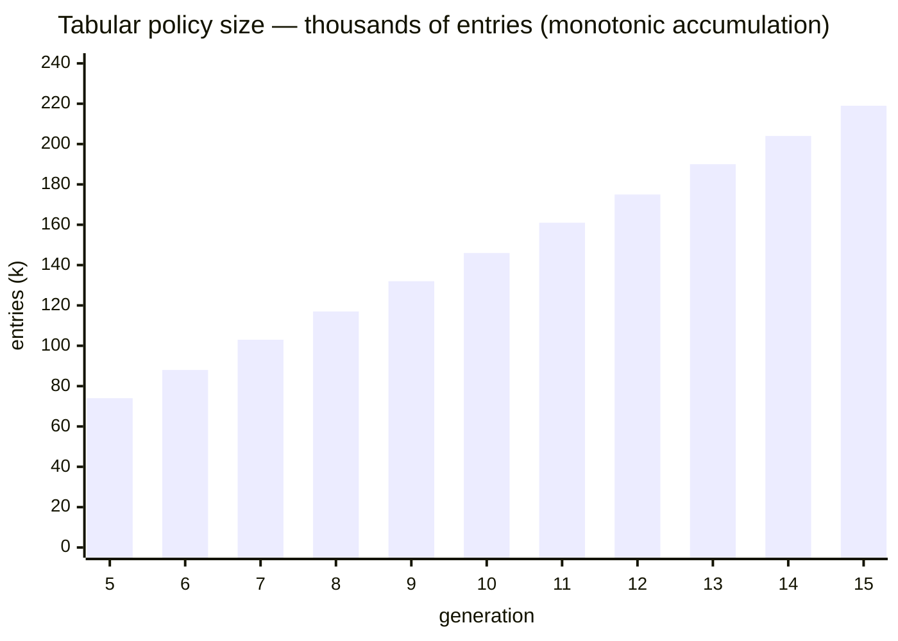

# MDP / POMDP system — report & learning rate

A snapshot of how the soccer engine models each player's decision as an
**MDP/POMDP**, how it learns (neural actor-critic + tabular Q + MAPPO team
credit), how big the problem is (variable counts), and **how fast it is
climbing** on the live local run (`codex-local-neural-climb`).

> Generated from the running learner + RDS on 2026-07-03. Fitness is noisy
> self-play `match_fitness`; policy-entry growth is the cleaner accumulation
> signal. Regenerate any time — the numbers move as the learner climbs.

---

## The decision → reward → learning loop

The engine is deliberately a **portfolio**: LP/IPM for team shape, MPC for
trajectory execution, **MDP/POMDP for the action decision**, neural nets as the
function approximators scoring those decisions, and MAPPO to share credit across
the team. (The genetic/evolution outer loop is **disabled** on this run — neural
nets do the learning.)

---

## How big is the problem? (variables)

| Dimension | Count | Notes |
|---|---:|---|
| Base state observation | **192** | per-player POMDP feature vector (`SOCCER_NEURAL_BASE_FEATURE_DIM`) |
| Specialised head features | ~**10** vectors | back-four 18, midfield-band 14, support-spacing 8, belief 4, option-control 8, … |
| Decision agents | **22** | 11 v 11, each an MDP/POMDP decision-maker |
| Neural net | **~14.7k params** | actor-critic, 24 hidden units, per-tick gradient |
| Learnable POMDP heads | ~**12** | pass-completion, shot-trigger, separation-floor, lane-affinity, onside-support, goal-side-recovery, slip-break, crash-box, pass-lane-yield, support-scorer, back-four line, midfield band |
| Tabular Q-policy entries | **~219k** | state→action values, growing ~14.5k/gen |
| Reward / penalty terms | **84** | `*_POINTS` magnitude constants |
| Tunable parameters | **218** | `reward.*` and shaping tunables |
| Gated feature flags | **69** | `DD_SOCCER_ENABLE_*` A/B switches |
| Pitch grid | **12 × 24** | discretised field |

---

## How fast are we climbing?

**Cadence:** ~**13.5 min / generation** ≈ **4.4 generations/hour** (steady, 2 full 11v11 games per cycle).

**Policy growth (cleanest accumulation signal):** ~**14,500 new tabular Q-entries per generation** — near-linear, the policy is genuinely covering more of the state space each cycle.

**Fitness (self-play `match_fitness`, noisy):** range ~1.1–4.8; **peaks are rising** — gens 11–13 ≈ 4.8 vs gens 5–7 ≈ 1.1. Best 4.84 @ gen 12.

### Quantifying "rate of learning" — honestly

Self-play fitness is a **relative** score (the policy plays itself), so it is
inherently noisy and **not** a clean learning-rate meter. The trustworthy signals:

1. **Policy coverage** — entries/gen (~14.5k), steady → still discovering states.
2. **Fitness peak trend** — rising (≈1 → ≈4.8) → the ceiling is moving up.
3. **Neural head loss** — per-head training loss is small and falling (e.g. onside-support ~1e-3, pass-completion ~8e-2).

The **rigorous** rate would be **held-out Elo vs a frozen baseline** measured
every N generations (`soccer_eval_gate_run`) — a monotone, low-variance curve.
That is not yet tracked over time; wiring it in is the next step to turn "climb"
into a hard, plottable learning-rate number.

---

## Reward hierarchy (what the policy optimises)

| Tier | Signal | Points |
|---|---|---:|
| Terminal | **Goal** (+ on-target tier) | 100 (+40) |
| Terminal | Shot on target | 40 |
| Ball-winning | Steal / duel / interception (×2.5 in box) | 10 → 25 |
| Discourage | Turnover / intercepted pass (backward ×3) | −6 … −40 |
| Discourage | Backward pass · stall · over-dribble | −28 · −18 · −16 |
| Encourage | First-touch / quick-release forward pass | +7 / +5 |
| Encourage | Upfield advance (carrier + support, MAPPO-shared) | dense |
| Shaping | Spacing / positioning / progression | ≤ ±12 / tick (budget-clamped) |

**Architecture is sound:** sparse outcomes are uncapped, dense shaping is
budget-clamped so it can't swamp them, and goal/shot back-prop chains
(`[30,22,15…]`, `[12,9,6…]`) credit the build-up.

---

## Endgame: freeze & bake

Every generation persists the **full neural net (~324 KB) + tabular policy** to
RDS and resumes the latest, so learning **compounds durably**. When the curve
plateaus we **bake** it: export the active policy's neural snapshot + high-visit
tabular entries and embed them as a compile-time default (`include_bytes!`), so
the engine runs the learned policy with **zero DB dependency** — fast enough for
real-time — and the accumulated learning can never be lost.
