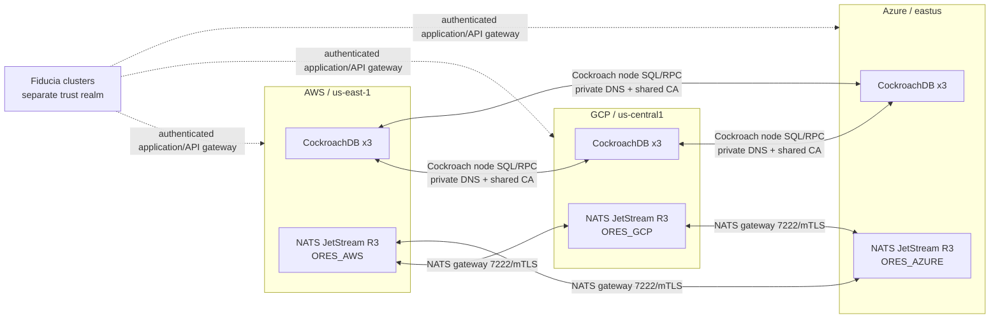

# Multi-cloud CockroachDB and NATS data plane

This document defines the target data plane for the AWS, GCP, and Azure Kubernetes clusters.
It implements the architecture recorded in [DEN-3951](https://linear.app/denman/issue/DEN-3951)
and the Linear document
[NATS multi-cloud architecture: AWS, GCP, Azure, k8s-cluster, and Fiducia](https://linear.app/denman/document/nats-multi-cloud-architecture-aws-gcp-azure-k8s-cluster-and-fiducia-f4b7dfcb1a07).
The two supplied Gemini shares are useful background sketches, but this contract adds the
storage, identity, failure-domain, and activation boundaries needed for production GitOps.

The manifests live under `remote/argocd/multicloud-data-plane`. They are registered as manual
ArgoCD Applications in the AWS and GCP roots and in the new Azure bootstrap root. Registration
does not deploy either stateful system: an operator must satisfy every activation gate and sync
the child Applications in the order below.

## Topology and authority

CockroachDB is one logical SQL cluster with three nodes in each cloud region, for nine nodes in
the final topology. Its durable volumes stay region-local, but CockroachDB replication and range
placement span the three regions. Application schema and migration authority remains in the
owning `*-lib-core`/database contract repository. The operator must not gain schema authority;
`postInitSQL` is deliberately absent from the Helm values.

Nine nodes do not, by themselves, assign a database's primary region, secondary regions, table
localities, or survival goal. Each owning database contract must declare those settings through its
reviewed migration/operations path and test the latency and availability consequences. Do not hide
`ALTER DATABASE ... PRIMARY REGION`, `ADD REGION`, `SURVIVE REGION FAILURE`, or table-locality
changes in the Kubernetes chart. Verify system-range placement and every product database after
each region joins.

NATS is not backed by CockroachDB. Each cloud owns an independent three-server JetStream Raft
group and a unique JetStream domain. Gateways connect the three NATS clusters for Core NATS
interest routing and geographic affinity; they do not turn the regional JetStream stores into a
single WAN Raft group and do not replicate durable streams automatically. Cross-region stream
durability requires explicit JetStream mirrors/sources, snapshots, or an application outbox.
CockroachDB is the authority for transactional outbox/inbox state, idempotency keys, and fenced
product effects when those guarantees are required.

Fiducia is not a fourth NATS gateway member in this contract. Its clusters retain a separate
identity and network trust realm. Traffic crosses through an authenticated, allowlisted
application/API gateway with replay protection, bounded payloads, redacted telemetry, and
idempotent request semantics. A future decision may use NATS leaf nodes or another protocol
behind that gateway, but it must not silently share the ORES NATS account, client token, CA, or
JetStream domain.

## Pinned components

The GitOps Applications pin these releases instead of following a moving chart tag:

- CockroachDB v1beta1 operator chart `cockroachdb-operator-chart` `1.0.0`.
- CockroachDB database chart `cockroachdb-chart` `26.3.1`.
- NATS chart and server `2.14.6`.
- cert-manager `v1.21.1` and trust-manager `v0.24.0` for private certificate issuance and
  public trust-bundle projection.

The CockroachDB v1beta1 operator is the supported multi-region, multi-Kubernetes implementation.
Do not replace it with the legacy v1alpha1 `cockroach-operator` chart. Before upgrading any pin,
render all three providers, read the upstream release notes, verify CRD conversion/rollback, and
exercise restore and regional-failure tests.

## Network and DNS contract

The three VPC/VNet networks need private, bidirectional routing. Public load balancers are not an
acceptable substitute. The provider values request internal load balancers and restrict NATS
gateway source ranges to RFC1918 space; narrow those ranges to the actual peer cluster CIDRs before
activation. GCP and Azure also admit only their documented load-balancer health-probe ranges on the
gateway port; those exceptions are health checks, not client ingress.

Required paths are:

| Producer | Destination | Port | Purpose |
| --- | --- | ---: | --- |
| CockroachDB nodes | peer-region CockroachDB private service | 26257/TCP | SQL/RPC join and replication |
| CockroachDB operator | Kubernetes API in its local cluster | 443/TCP | local reconciliation only |
| NATS gateways | peer-region NATS gateway private service | 7222/TCP | supercluster gateway mTLS |
| NATS clients | local `dd-nats-supercluster` ClusterIP | 4222/TCP | local mTLS + token client traffic |
| NATS servers | local headless peers | 6222/TCP | regional Raft/routes only |

Private DNS must resolve these names from all three clusters:

- `dd-cockroachdb.cockroachdb.svc.aws.crdb.k8s.ores.internal`
- `dd-cockroachdb.cockroachdb.svc.gcp.crdb.k8s.ores.internal`
- `dd-cockroachdb.cockroachdb.svc.azure.crdb.k8s.ores.internal`
- `nats-gateway.aws.k8s.ores.internal`
- `nats-gateway.gcp.k8s.ores.internal`
- `nats-gateway.azure.k8s.ores.internal`

The CockroachDB records target each region's internal CockroachDB Service. The NATS records target
the regional `dd-nats-gateway` internal LoadBalancer. Certificates must include the corresponding
DNS name as a SAN. Split-horizon public records are forbidden for these names.

## Secret contract

No certificate, key, token, URL containing credentials, or cloud credential belongs in Git. Each
cluster must already have the provider-specific `ClusterSecretStore/dd-cluster-secrets`. The
prerequisites Application materializes these namespace-local targets from the same provider-neutral
remote keys:

| Kubernetes Secret | Remote key | Required keys | Scope |
| --- | --- | --- | --- |
| `cockroachdb/dd-cockroachdb-ca` | `dd/multicloud/cockroachdb-ca` | `tls.crt`, `tls.key` | identical CA in all three clouds; CreatedOnce |
| `cert-manager/dd-cockroachdb-ca-trust-source` | `dd/multicloud/cockroachdb-ca` | `tls.crt` only | public CA source for trust-manager |
| `nats-system/dd-nats-ca` | `dd/multicloud/nats-ca` | `ca.crt` | identical gateway/client trust CA |
| `nats-system/dd-nats-client-tls` | `dd/multicloud/nats-client-tls` | `tls.crt`, `tls.key` | provider-specific server certificate |
| `nats-system/dd-nats-route-tls` | `dd/multicloud/nats-route-tls` | `tls.crt`, `tls.key` | provider-specific regional route certificate |
| `nats-system/dd-nats-gateway-tls` | `dd/multicloud/nats-gateway-tls` | `tls.crt`, `tls.key` | provider-specific gateway certificate |
| `nats-system/dd-nats-client-auth` | `dd/multicloud/nats-client-auth` | `token` | rotate independently per environment |

cert-manager receives the same CA key in all three clusters and generates local node, HTTP, and
root-client certificates. trust-manager publishes only the public CA certificate into the
`ConfigMap/dd-cockroachdb-ca` required by the CockroachDB operator. CA custody, escrow, rotation,
and access audit remain human-owned. The CA ExternalSecret uses `CreatedOnce`; rotation requires a
reviewed reissue and rolling-restart procedure rather than an unattended secret refresh.
NATS requires both a trusted client certificate and the token. This is a fail-closed bootstrap for
the new plane; subject-level operator/account JWTs are still required before general production
tenant adoption.

The NATS server certificates have distinct jobs. `dd-nats-client-tls` must cover the local
`dd-nats-supercluster` Service DNS names, `dd-nats-route-tls` must cover the StatefulSet/headless
Service names, and `dd-nats-gateway-tls` must cover that provider's
`nats-gateway.<provider>.k8s.ores.internal` name. All require server authentication; route and
gateway certificates also require client authentication. Workload client certificates are issued
separately, use client authentication, and are never stored in the server bundle.

## Activation gates

Do not sync a child Application until all applicable gates are green:

1. Each cloud has at least three schedulable worker nodes across three distinct
   `topology.kubernetes.io/zone` values and the expected region label (`us-east-1`,
   `us-central1`, or `eastus`). Kubernetes is at least 1.30.
2. `StorageClass/dd-block` dynamically provisions encrypted RWO volumes in that cloud. Volume
   snapshots, object-store backups, restore ownership, retention, and alerting have been tested.
3. Private routing and the six DNS records above work in both directions. TCP 26257 and 7222 are
   not publicly reachable. Provider load-balancer health checks are explicitly allowlisted.
4. `dd-cluster-secrets` is Ready and every ExternalSecret is Ready. The Cockroach CA is byte-for-byte
   identical across providers; NATS certificates chain to the shared NATS CA and contain the right
   SANs. Secret rotation is tested without exposing values.
5. Resource quotas cover three CockroachDB nodes (each requesting 2 CPU/8 GiB and 100 GiB) and
   three NATS nodes (each requesting 500m CPU/1 GiB and 50 GiB), plus system overhead.
6. The existing `messaging/dd-nats` bootstrap remains authoritative until publishers, consumers,
   streams, credentials, and rollback have been inventoried. No in-place StatefulSet conversion is
   allowed.

The current AWS EC2 kubeadm cluster is a single node and therefore intentionally fails gate 1.
The Azure root is a future bootstrap profile and intentionally has no Azure Key Vault
`dd-cluster-secrets` implementation yet. Those are deployment blockers, not reasons to weaken the
spread constraints or TLS contract.

## Bootstrap and promotion order

1. Bootstrap the Azure root when that cluster exists. On all three clusters, verify ArgoCD sees the
   six `dd-multicloud-*` child Applications but has not synced them.
2. Adopt or install the pinned cert-manager Application, then sync trust-manager. Treat an existing
   cert-manager installation as a takeover/upgrade: diff it first and never delete its CRDs.
3. Sync `dd-multicloud-data-prerequisites-<provider>` and verify every ExternalSecret, Issuer,
   Certificate, and the `Bundle/dd-cockroachdb-ca` target ConfigMap is Ready.
4. Sync all three CockroachDB operator Applications and verify the v1beta1 CRDs and operator
   health. Operators watch only the `cockroachdb` namespace.
5. Bootstrap CockroachDB from exactly one region. Start with AWS's three nodes, initialize once,
   then add GCP and Azure to the same logical cluster in sequence. Never initialize GCP or Azure as
   an independent cluster. Reconcile the final three-region values everywhere after each join.
6. Verify nine live nodes, region/zone localities, zero unavailable ranges, balanced replicas, SQL
   TLS, node-drain behavior, backup, point-in-time restore, and loss of one complete region.
7. Sync the three NATS Applications. Verify each independent R3 JetStream cluster locally before
   opening the gateway path. Then verify all six directed gateway connections, mTLS rejection,
   `reject_unknown_cluster`, and recovery after a regional disconnect.
8. Define explicit stream mirror/source policies and outbox consumers. Prove PubAck, redelivery,
   DLQ, mirror lag, snapshot restore, promotion RTO, and that retries cannot duplicate a protected
   product effect.
9. Shadow traffic from the existing `messaging/dd-nats`, compare effects, canary consumers, then
   promote one subject family at a time. Rollback returns clients to the old service; it never
   deletes the new PVCs. Remove the bootstrap service only after a separate reviewed decision.

Useful read-only checks after activation include `cockroach node status --certs-dir=...`,
`cockroach node locality`, NATS `/routez`, `/gatewayz`, `/jsz`, and stream replica state. Store the
redacted evidence with the release; local render success is not deployment proof.
