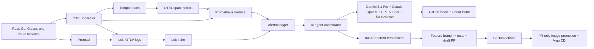

# Telemetry ticket and remediation automation

The cluster turns sustained, actionable telemetry into one deduplicated GitHub
issue and one Linear issue for the owning repository. It then queues a bounded
multi-model investigation and, at 04:00 `America/New_York`, an ordered
feature-branch remediation workflow.

## Signal policy

- Prometheus alert rules cover service availability, explicit application
  metrics, OTEL collector health, and error spans derived by the `spanmetrics`
  connector.
- Loki ruler alerts require either three `ERROR`/`FATAL` `dd.log.v1` records in
  five minutes or twenty `WARN` records in ten minutes. Isolated log lines do
  not become tickets.
- Alertmanager groups and deduplicates by alert, cluster, namespace,
  deployment, and service before calling the coordinator with a bearer token.
- Ticket evidence is allowlisted. Raw log bodies, request/task/user IDs,
  trace/span IDs, credentials, and customer data are not copied into prompts or
  ticket bodies.
- The coordinator uses a stable fingerprint marker to search and upsert rather
  than creating a new issue for every notification. A recurring incident may be
  queued for remediation at most once per UTC occurrence day.

## Ownership and Linear routing

The coordinator resolves the repository from an explicit
`repository`/`github_repository`/`source_repository` alert label first, then
from the deployment/service mapping in its `TELEMETRY_REPOSITORY_MAP`.

Linear projects resolve in this order:

1. exact `github.com/<org>/<repo>` project;
2. `github.com/<org>` project;
3. `Shared Platform & Portfolio Architecture`.

The GitHub organization is therefore the Linear portfolio boundary, while
repository projects can opt into a narrower queue without changing alert
rules.

## Model workers

`dd-ai-agent-runner-config` declares four non-secret bridge identities:

- `google-gemini-3.1-pro` → `gemini-3.1-pro-preview`;
- `anthropic-claude-5` → `claude-opus-5`;
- `openai-chatgpt-5.6-sol` → `gpt-5.6-sol`;
- `openai-chatgpt-5.6-sol-reviewer` → `gpt-5.6-sol`.

The first three produce independent analyses. Only the distinct reviewer
submission can become the enriched ticket body. Provider failures fall back to
the deterministic, redacted incident body rather than blocking delivery.

The 04:00 Eastern run queues Gemini investigation, Claude review, then Codex
implementation through the worker broker. The implementation contract requires
a feature branch, repository tests and linters, GitHub Actions coverage, an
intentional commit, a pushed branch, and a draft PR. It forbids default-branch
writes and merging.

## Required secret bundles

Create these JSON bundles in the secret backend used by
`dd-cluster-secrets`; never commit their values.

`dd/remote-dev/telemetry-ticket-automation`:

- `TELEMETRY_WEBHOOK_TOKEN`
- `TELEMETRY_GITHUB_TOKEN`
- `LINEAR_API_TOKEN`
- `TELEMETRY_BRIDGE_BEARER`
- `TELEMETRY_WORKER_BROKER_AUTH`

`dd/remote-dev/ai-agent-runner-secrets`:

- `GEMINI_API_KEY`
- `ANTHROPIC_API_KEY`
- `OPENAI_API_KEY`

The coordinator and model runner fail closed when required bundles or keys are
missing. Confirm both External Secrets are Ready before merging the GitOps PR.

## Upstream GitOps promotion

Instrumented service repositories use their `request k8s promotion` workflow
after a change lands on the default branch. The workflow sends only the exact
repository name and full commit SHA to this repository. The
`telemetry upstream promotion` workflow accepts an explicit allowlist, fetches
that SHA from the configured submodule origin, advances the submodule on a new
`agent/promote-*` branch, and opens a draft PR against `dev`. It never merges or
deploys the result.

Configure these repository secrets:

- `K8S_CLUSTER_DISPATCH_TOKEN` in each instrumented upstream repository: a
  fine-grained token or GitHub App token permitted to create repository
  dispatches in `ORESoftware/k8s-cluster`;
- `ORG_GITOPS_TOKEN` in `ORESoftware/k8s-cluster`: contents and pull-request
  write access here plus read access to the allowlisted upstream repositories,
  so promotion pushes trigger the normal PR checks.

Keep these automation credentials separate from the two cluster runtime secret
bundles above.

## Delivery sequence

1. Provision the two runtime secret bundles and promotion credentials above,
   and rotate the private-submodule CI token if its checks are not green.
2. Merge and release `ORESoftware/ai-agent-coordinator.rs`.
3. Let its OCI workflow open the draft immutable-image promotion PR; validate
   and merge that PR.
4. Merge this repository's GitOps PR into `dev`, which installs the
   repository-dispatch receiver before any upstream tries to call it.
5. Merge the service instrumentation PRs, then review and merge the
   automatically opened draft submodule-promotion PRs.
6. Verify Alertmanager, Loki ruler, OTEL span metrics, the coordinator, the
   runner, and each promoted workload are healthy before enabling
   repository-specific alert thresholds.

No workflow in this design merges a PR automatically. Argo CD observes only
reviewed manifests after their PRs have merged.
